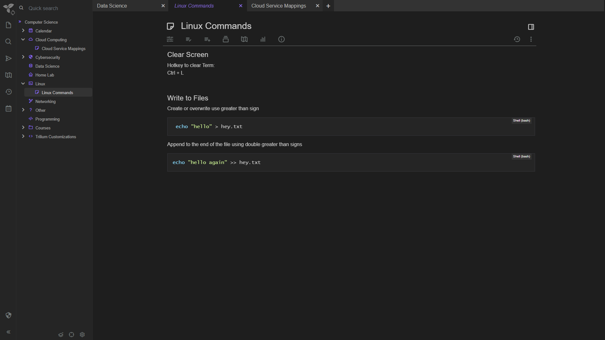
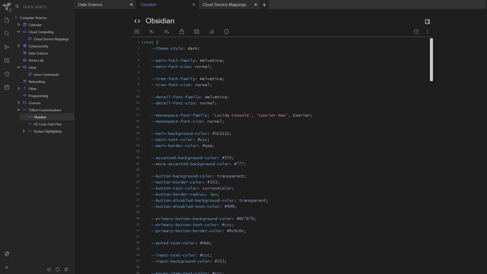
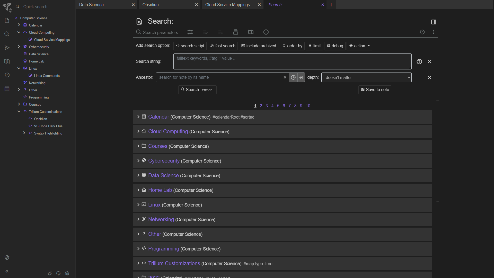

# trilium-obsidian-theme
[Trilium Notes](https://github.com/zadam/trilium) custom theme.
- Dark theme inspired by MS Visual Studio Code's default dark theme (dark+) with additional minor purple highlights.
- Updated fonts to websafe for easy web viewing. 
- Easy to view and modern color scheme.

## Instructions
- Create a new note in Trilium notes.
- Under the Basic Properties tab, set Note type to Code and choose the CSS option
- Under the next tab over, called Owned attributes, paste in the following: #appTheme=Obsidian 
- In the body of the notes paste the contents of Obsidian.css
- Click on the Trilium icon at the top left of the page and choose Options
- Select Appearance and choose Obsidian in the drop down under Theme

If you do not see Obsidian as an option, try refreshing the page in your browser. 

## Preview

*This theme is a work in progress.  Please feel free to update, add to, modify, or fix.  Commits welcome.
